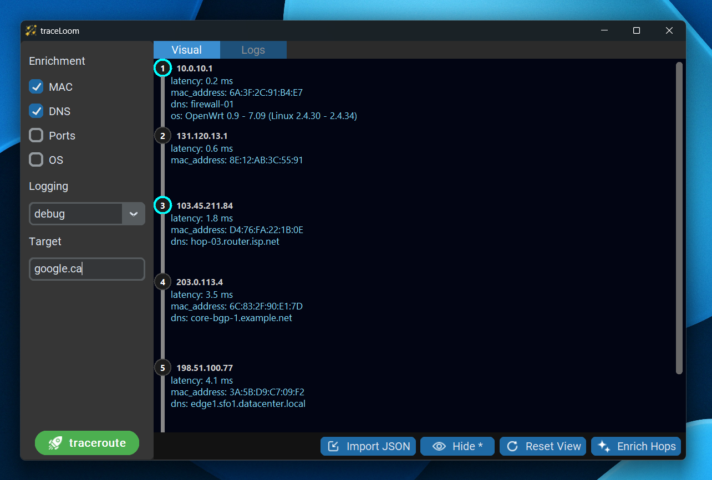

# traceLoom

**traceLoom** is a Python-based traceroute tool that enriches each hop with additional network context.



## Enrichments
- Latency  
- MAC Address  
- TCP Ports  
- DNS Records  
- OS (via Nmap)

## Usage
```bash
./traceLoom -t <target>
```
